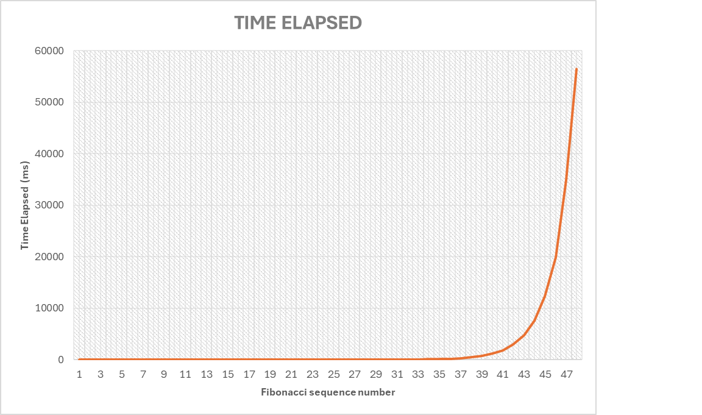
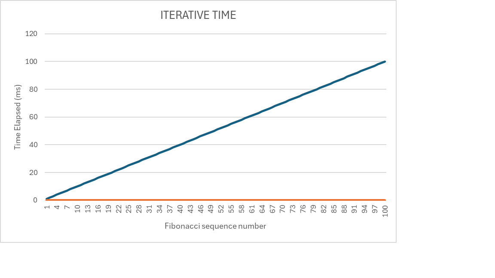

# CLOSURE TIMER ASSIGNMENT

## FIBONACCI NUMBERS

In this assignment I produced a Write a JS application in Node.js that uses closures to implement timers and observe the timing of two different ways of calculating Fibonacci numbers. We should
be able to make as many sets of timers as you would like to create. We will write our program in a way that ouputs a csv format so you can redirect program output to a csv file documenting the timing
of each.

## INSTRUCCIONS:

Interface Details:

In terms of program interaction, please implement the following command line interface:

NAME

fibonacci.js - Outputs timing data for fibonacci sequence of arbitrary size either recursively or iteratively

SYNOPSIS

fibonacci.js [OPTION]

## OPTIONS

-r NUM, --recursive NUM

Outputs the timing date in csv form for all fibonacci numbers from 1 to NUM recursively

-i NUM, --iterative NUM

Outputs the timing date in csv form for all fibonacci numbers from 1 to NUM iteratively

-h, --help

Output a usage message and exit.

EXIT STATUS

Normally the program should exit with a status of 0 if no errors have occurred, if an error occurred such as NUM < 1 the process will exit with a status of 1.

This Program you have to use these commands following like you could see below in the next lines:

Iterative Call:
"node fibonacci.js -i 42"

Recursive call:
"node fibonacci.js -r 42"

but if would you like to get those data you have to use these commands.

Iterative call
"node fibonacci.js -i 42 > iterative.csv"

Recursive call
"node fibonacci.js -r 42 > recursive.csv"

## GRAPH:

Recursive graph by Time elapsed with Fibonacci Method

Iterative graph by Time elapsed with Fibonacci Method

SOLANGE CORREA - correaholguins2@winthrop.edu
